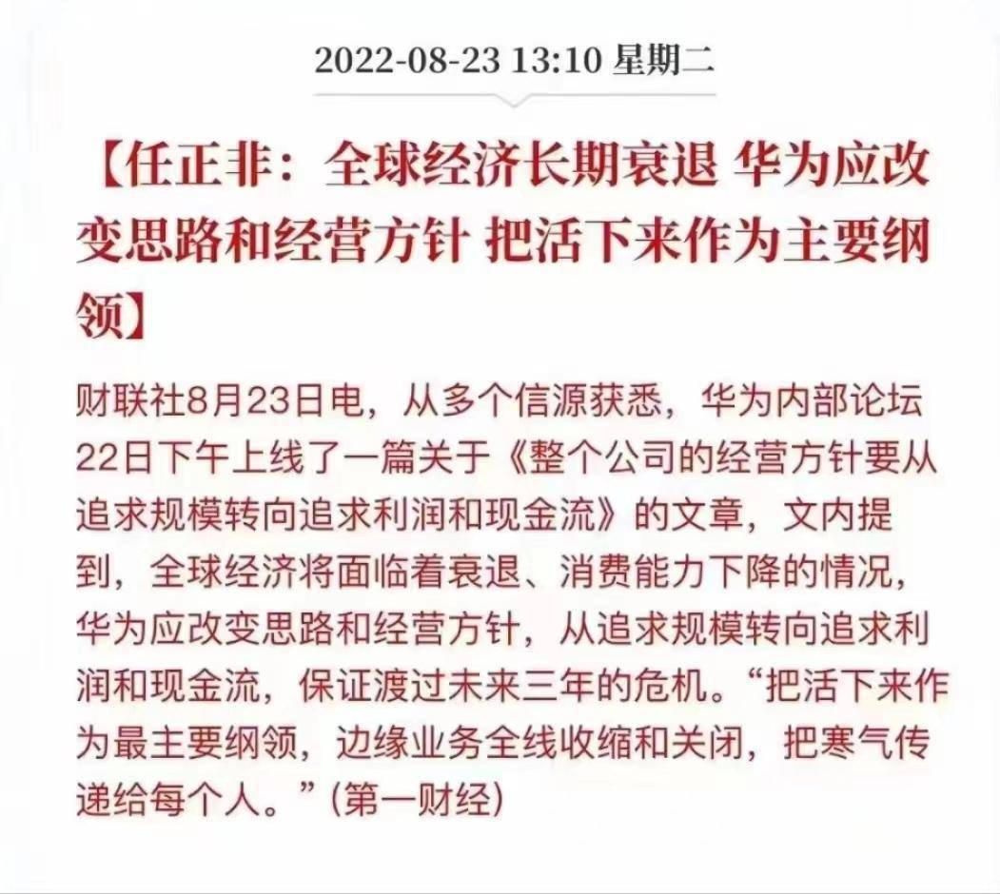

# Winnter is comming

## 凛冬将至

国际疫情逐渐失控，台海、中美关系紧张加剧，中国出生人口骤降，房地产市场变天，这让我们每个人都有了不好的预感。

2022年8月22日，任正非老爷子在华为内部发表公开文章，要把寒气传给每个人。之后，华为南京地区的外包人员全部被裁。

> 任正非 表示：
>
> 1. 未来十年应该是一个非常痛苦的历史时期，全球经济会持续衰退，全世界的经济在未来3到5年内都不可能转好；
> 2. 生存基点要调整到以现金流和真实利润为中心，不要讲故事，一定要讲现实；
> 3. 聚焦关键，作出竞争力；
> 4. 把寒气传递下去。

全国各地大小企业同华为一样处在寒冬之中，社会大环境已经过了快速发展期，互联网成为了劳动密集型产业，程序员==新时代农民工
应届生被裁，业务线连锅端，唇亡齿寒。公务员也出现降薪裁员，铁饭碗也不再是永恒的铁饭碗，一切有了20年前的迹象

未来的日子需要做好捂住钱包、强壮肌肉的准备！！！！

## 如何抵御严寒

著名小说/美剧《权利的游戏》中，守夜人的誓词有这样的两句话，我认为可以用在回答“如何抵御严寒”这个问题上：

> I am the sword in the darkness
>
> I am the fire that burns against the cold

### 1. 磨利手中的佩剑

作为一个软件开发工程师，要强化技术能力，认清实际环境，有的放矢的去学习和快速掌握企业级软件开发技术

以业务和市场为导向，记住，技术和技术人员不是高高在上的，而是可以被随时替代的。技术永远都要为业务服务。

### 2. 保持心中的火焰常燃

始终对生活保有热情，不可沉沦于现状，更能抱有孩童般的幻想。放弃幻想，准备斗争。

***世上只有一种英雄主义，就是在认清生活真相之后依然热爱生活。——罗曼·罗兰***

## 